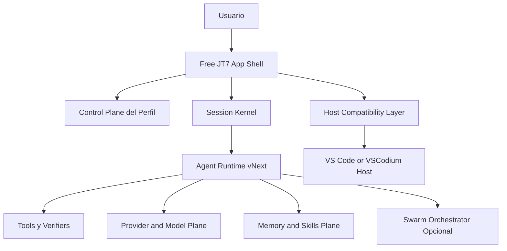

# 24. Arquitectura Formal Free JT7 vNext

Estado: aprobado (incluye integracion Hermes)
Fecha: 2026-05-02
Actualizacion: 2026-05-02 - Integracion explicita de Hermes Agent aprobada
Alcance: arquitectura objetivo del producto Free JT7 para migrar desde una extension con panel/webview hacia un IDE agent-first real, con runtime propio, control-plane propio, orquestacion de subagentes y compatibilidad secundaria con hosts tipo VS Code.

## 1. Resumen ejecutivo

Free JT7 no debe seguir tratandose como una extension con un panel webview acoplado al host. El estado actual del repo confirma que la experiencia visible y buena parte del ownership del producto siguen anclados a:

- `package.json` como manifiesto primario de extension
- `extension.js` como bootstrap de extension
- `src-js/core/control-panel.js` como shell visible monolitica
- `src-js/core/extension.runtime.js` como broker de runtime dependiente del host

Al mismo tiempo, el repo ya contiene una base tecnica reutilizable suficiente para no rehacer todo desde cero:

- `src-js/core/freejt7-agent-core-v2.js` ya implementa planner, registry de tools, verificacion y trazabilidad
- `src-js/core/provider-registry.js` ya concentra buena parte del catalogo de providers/modelos
- `src-js/core/session-engine.js`, `src-js/core/policy-engine.js` y `src-js/core/audit-bus.js` ya son piezas validas del futuro kernel
- `scripts/freejt7-owned-control-plane.js`, `scripts/freejt7-app-bootstrap.js` y `scripts/freejt7-own-ide-bootstrap.js` ya introducen un ownership de perfil/app superior al de una extension tipica

La decision formal de arquitectura es una sintesis dirigida por referencias externas y por el estado real del repo:

- OpenHands para runtime, sesiones, bucles y ownership del trabajo
- Hermes Agent para proveedores, memoria, skills y delegacion controlada
- Open Design para shell UX y separacion entre adaptadores y daemon
- Claurst para permisos, settings, tareas y comportamiento operativo tipo Claude Code
- MiroFish solo como inspiracion de enjambre opcional para tareas complejas
- Athena como referencia de pluginizacion posterior, no como patron inicial dominante

## 2. Drivers aprobados

### Drivers de producto

1. Free JT7 debe comportarse como Manus, Trae o Codex en su propio IDE, no como un panel accesorio.
2. La seleccion de proveedor, modelo, claves API y catalogo debe ser una capacidad propia del producto.
3. El sistema debe poder resolver una solicitud en una sola interaccion mediante desglose y uso de subagentes/enjambre cuando aporte valor real.
4. El empaquetado debe sostener instalacion real de app/IDE y no solo distribucion de VSIX.

### Restricciones explicitas

1. No adoptar ciegamente un solo repo externo.
2. No reconstruir todo desde cero si el repo actual ya contiene un nucleo reusable.
3. Mantener compatibilidad secundaria con el host tipo VS Code mientras exista transicion.
4. Priorizar un corte limpio controlado y verificable por fases.

### No objetivos de esta fase

1. No convertir aun Free JT7 en un binario nativo completo ajeno a VSCodium.
2. No abrir todavia una plataforma general de plugins third-party.
3. No introducir enjambre obligatorio para cada solicitud.

## 3. Diagnostico del estado actual

## 3.1 Sintomas arquitectonicos

- El producto sigue presentando su identidad principal a traves del manifiesto de extension y del webview actual.
- La shell visible esta demasiado concentrada en `src-js/core/control-panel.js`.
- Existen duplicados funcionales por carpetas (`runtime`, `bridge`, `scheduler`, `plugins`, `memory`, `providers`) que diluyen la autoridad por modulo.
- La compatibilidad con Copilot/host y el runtime real siguen compartiendo demasiado control path.

## 3.2 Activos que deben sobrevivir

- Nucleo de herramientas y verificadores en `src-js/core/freejt7-agent-core-v2.js`
- Gestion de sesiones, policy y auditoria ya presente en `src-js/core/session-engine.js`, `src-js/core/policy-engine.js`, `src-js/core/audit-bus.js`
- Catalogo y configuracion de modelos/proveedores en `src-js/core/provider-registry.js` y `src-js/core/provider-config.js`
- Bootstrap/control-plane de app propia en `scripts/freejt7-owned-control-plane.js`, `scripts/freejt7-app-bootstrap.js`, `scripts/freejt7-own-ide-bootstrap.js`

## 3.3 Deuda que obliga al corte limpio

- `src-js/core/control-panel.js` mezcla shell UX, persistencia, wiring de runtime, catalogo y comportamiento del producto.
- `package.json` y `src-js/core/extension.runtime.js` siguen mandando demasiado en la experiencia principal.
- Hay pares duplicados que deben consolidarse:
  - `src-js/runtime/remote-bridge.js` y `src-js/bridge/remote-bridge.js`
  - `src-js/runtime/agent-scheduler.js` y `src-js/scheduler/agent-scheduler.js`
  - `src-js/runtime/plugin-runtime.js` y `src-js/plugins/plugin-runtime.js`
  - `src-js/runtime/memory-orchestrator.js` y `src-js/memory/memory-orchestrator.js`
  - `src-js/core/api-provider-adapter.js` y `src-js/providers/api-provider-adapter.js`

## 4. Principios de arquitectura vinculantes

1. El producto visible es Free JT7. El host es un adaptador, no la identidad del sistema.
2. El runtime del agente es el dueño del trabajo. El proveedor solo razona y no cierra tareas sin evidencia verificable.
3. La shell visible debe separarse del runtime y del control-plane.
4. Los permisos, settings, tareas, skills, memoria y providers deben tener un owner unico por dominio.
5. La compatibilidad con extension/chat participant debe quedar subordinada y congelada como capa secundaria.
6. El enjambre de subagentes sera opt-in, trazable y orientado a ahorro de tokens y paralelismo real, no decorativo.

## 5. Arquitectura objetivo



## 5.1 Capa Shell

La shell vNext es la experiencia principal del producto. Debe:

- abrir por defecto en modo Free JT7
- exponer chat, tareas, contexto, settings, catalogo de modelos y estado del agente como superficies propias
- funcionar aunque el host siga siendo VSCodium/VS Code en la primera etapa
- dejar de depender conceptualmente del activity bar webview actual

## 5.2 Control Plane

El control-plane del perfil es la fuente de verdad operativa. Debe gobernar:

- modo del producto
- configuracion de runtime
- proveedor y modelo activos
- permisos operativos
- sesiones y estado resumido
- features de swarm/subagentes

El control-plane debe tener prioridad sobre settings dispersos del host y sobre `globalState` legado.

## 5.3 Session Kernel

El kernel de sesion consolida:

- historial util
- estado corto del agente
- continuidad post-restart
- task state
- verificacion y auditoria

La autoridad funcional parte de `src-js/core/session-engine.js` y converge hacia un solo contrato de sesion.

## 5.4 Agent Runtime

El runtime vNext se apoya en `freejt7-agent-core-v2` y asume estas responsabilidades:

- planificacion por objetivo real del usuario
- seleccion de capacidades y tools
- ejecucion local verificable
- delegacion a subagentes cuando corresponda
- subordinacion de providers/OpenClaw/host compatibility
- cierre de tarea solo con evidencia

## 5.5 Provider and Model Plane

El plano de providers/modelos debe ofrecer:

- catalogo unificado
- configuracion por proveedor y por modelo cuando haga falta
- health y fallback multi-provider
- aislamiento entre compatibilidad host y producto principal
- soporte para proveedores externos y locales

La fuente de verdad inicial del dominio es `src-js/core/provider-registry.js` con convergencia de `provider-config`, `provider-router` y `api-provider-adapter`.

## 5.6 Memory and Skills Plane

La memoria y skills deben moverse a un dominio coherente con:

- contexto jerarquico
- integracion de skills como plan operativo
- persistencia ligera por sesion
- uso de memoria como soporte del runtime y no como capa lateral

## 5.7 Swarm Orchestrator opcional

El enjambre no sera la ruta por defecto. Se activa cuando una tarea cumpla condiciones como:

- subtareas paralelizables
- necesidad de investigacion y ejecucion en paralelo
- beneficio real de tokens o latencia
- necesidad de especializacion por herramienta

El runtime principal genera el desglose y el swarm ejecuta bajo politica y trazabilidad.

## 5.8 Host Compatibility Layer

VS Code, VSCodium y cualquier chat participant quedan como adaptadores. Sus funciones en vNext son:

- arrancar Free JT7
- reenviar eventos o comandos
- alojar temporalmente una vista o participant de compatibilidad
- no definir ya el contrato principal del producto

## 6. Decisiones de diseno tomadas a partir de las referencias

| Referencia | Se adopta | Se rechaza o se posterga |
| --- | --- | --- |
| OpenHands | ownership fuerte del runtime, bus de eventos, sesion y control de trabajo | copiar la estructura completa del proyecto |
| Hermes Agent | **INTEGRACION PRIORITARIA**: credential_pool, memory_manager, context_compressor, skill_utils, skills/*, run_agent loop | traer toda la CLI o su organizacion exacta |
| Open Design | separacion shell/adapters/daemon y experiencia visible mas propia | replicar su stack de frontend tal cual |
| Claurst | permisos, tasks, settings y operacion tipo Claude Code | reimplementacion clean-room completa en otra base tecnologica ahora mismo |
| MiroFish | inspiracion para swarm optativo y desglose por subagentes | simulacion o enjambre como camino obligatorio |
| Athena | idea de pluginizacion por fases posteriores | plugin framework como prioridad del Hito 1 |

## 6.1 Integracion explicita de Hermes Agent como fuente de codigo reusable

**Fecha de decision**: 2026-05-02  
**Estado**: APROBADO  
**Razon**: Hermes Agent comparte el 80% del ADN arquitectónico objetivo de Free JT7 vNext. Su integracion acelera el desarrollo sin comprometer la arquitectura propia.

### Modulos de Hermes a integrar

| Modulo Hermes | Destino en Free JT7 | Hito | Prioridad |
| --- | --- | --- | --- |
| `skills/` (27 categorias) | `.github/skills/hermes/` | Inmediato | CRITICA |
| `agent/credential_pool.py` | `src-js/core/credential-pool.js` | H1-06 | ALTA |
| `agent/memory_manager.py` | Referencia para `src-js/memory/` | H1-04 | ALTA |
| `agent/context_compressor.py` | Adaptar a JS para `src-js/core/context-compressor.js` | H1-04 | ALTA |
| `agent/skill_utils.py` | Integrar en `src-js/core/skill-resolver.js` | H1-04 | MEDIA |
| `run_agent.py` | Referencia para `freejt7-agent-core-v2.js` | H1-04 | MEDIA |
| `agent/anthropic_adapter.py` | Referencia para provider adapters | H1-06 | MEDIA |
| `agent/error_classifier.py` | Integrar en `src-js/core/error-classifier.js` | H1-04 | BAJA |

### Codigo reusable verificado

```
hermes-agent/
├── skills/                          # 27 categorias de skills probadas
│   ├── software-development/        # git, testing, debugging
│   ├── productivity/                # automation, scheduling
│   ├── research/                    # web search, analysis
│   ├── mlops/                       # ML operations
│   └── ...
├── agent/
│   ├── credential_pool.py           # Multi-credential failover con cooldown
│   ├── memory_manager.py            # MemoryProvider abstracto + scrubbers
│   ├── context_compressor.py        # Compresion profesional con handoff
│   ├── skill_utils.py               # Frontmatter parsing + platform matching
│   └── error_classifier.py          # FailoverReason enum + classify_api_error
└── run_agent.py                     # Loop principal con tool calling
```

### Patron de integracion

1. **Skills**: Copia directa a `.github/skills/hermes/` con attribucion
2. **Modulos Python→JS**: Adaptacion idiomatia conservando logica
3. **Referencias**: Usar como especificacion ejecutable para validar implementacion
4. **Licencia**: MIT - compatible con Free JT7

### Criterios de integracion

- [ ] Skills de Hermes copiadas a `.github/skills/hermes/`
- [ ] `credential_pool.py` adaptado a JS
- [ ] `context_compressor.py` referenciado en core-v2
- [ ] `memory_manager.py` integrado con `context-hierarchy.js`
- [ ] Trazabilidad en `docs/MEMORY.md` de cada integracion

## 7. Fases de implementacion

### Hito 1. Corte de ownership y shell agent-first

Objetivo: que Free JT7 deje de sentirse y operar como panel de extension y pase a ser una shell agent-first sostenida por control-plane y runtime propios.

Resultados requeridos:

- shell visible desacoplada del `control-panel.js` actual
- ownership del perfil/control-plane consolidado
- runtime principal movido hacia `core-v2`
- compatibilidad host degradada a capa secundaria
- duplicados funcionales identificados y consolidados en la superficie critica

### Hito 2. Runtime unificado y continuidad real

Objetivo: concentrar el bucle del agente, sesiones, memoria util y verificadores bajo un contrato unico.

### Hito 3. Plano de providers y modelos profesional

Objetivo: separar catalogo, auth, health, fallback y seleccion de modelo del legacy del host.

### Hito 4. Permissions, skills y swarm operacional

Objetivo: permisos trazables, skills operativas y enjambre optativo controlado.

### Hito 5. Shell propia y empaquetado de producto

Objetivo: sostener el claim de producto propio con empaquetado coherente mas alla de la VSIX.

## 8. Criterios de aceptacion de la arquitectura

La arquitectura vNext se considerara aprobada para implementacion cuando:

1. El ownership del producto quede explicitamente del lado de Free JT7 y no del host.
2. El Hito 1 tenga backlog ejecutable por archivos/modulos reales del repo.
3. Exista una propuesta de corte limpio con clasificacion exacta de conservar, congelar y reemplazar.
4. Los modulos `core-v2`, providers, control-plane y session kernel queden identificados como base de supervivencia.
5. La compatibilidad con extension quede formalmente subordinada y congelable.

## 9. Riesgos y mitigaciones

| Riesgo | Impacto | Mitigacion |
| --- | --- | --- |
| Mantener demasiado tiempo el shell webview actual | El producto seguira sintiendose como extension | reemplazar primero `src-js/core/control-panel.js` y separar shell de runtime |
| Reescribir demasiado pronto el nucleo | Se pierde capital tecnico ya validado | conservar `freejt7-agent-core-v2`, `provider-registry`, `session-engine`, `policy-engine`, `audit-bus` |
| Introducir enjambre demasiado temprano | complejidad operativa y ruido | dejar swarm como opt-in posterior al corte de ownership |
| No consolidar duplicados | ownership ambiguo y regresiones | resolver duplicados en Hito 1 sobre bridge, scheduler, plugin, memory y provider adapter |

## 10. Checklist de aprobacion

- [x] Diagnostico del estado actual aterrizado al repo real
- [x] Referencias externas integradas como sintesis y no como copia
- [x] Arquitectura objetivo definida por capas y ownership
- [x] Fases definidas con prioridad explicita de Hito 1
- [x] Criterios de aceptacion y riesgos documentados
- [x] **Integracion explicita de Hermes Agent aprobada** (2026-05-02)
- [x] Aprobacion del usuario para ejecutar el backlog tecnico del Hito 1
